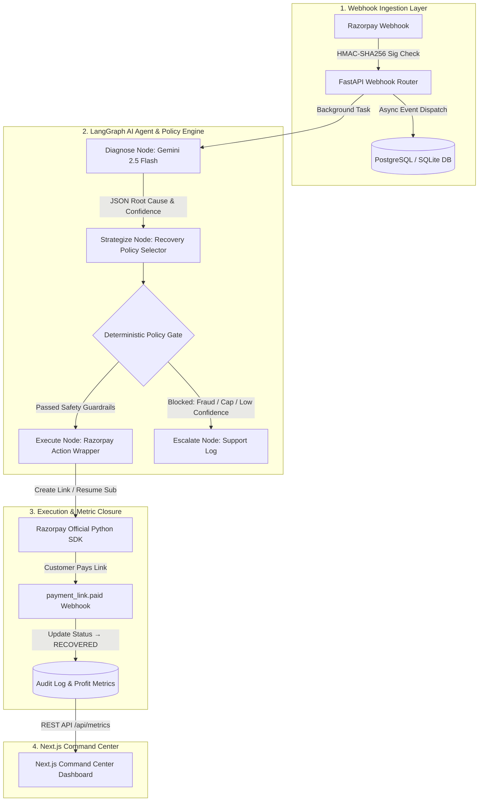

# AI Revenue Recovery Agent (Razorpay Buildathon — Track 3)

> **A closed-loop autonomous AI agent system that intercepts failed Razorpay transactions, diagnoses root causes using Gemini 2.5 Flash, evaluates deterministic safety policy guardrails, and executes automated revenue recovery.**

---

## 🌟 Executive Summary & Profit Value Proposition

Every failed checkout or subscription renewal represents lost profit. **AI Revenue Recovery Agent** bridges the gap between payment failure detection and revenue recovery:

1. **Instant Webhook Interception**: Listens to `payment.failed`, `subscription.pending`, and `subscription.halted` events in real-time.
2. **AI Root Cause Diagnosis**: Leverages Google Gemini 2.5 Flash via LangGraph to parse error codes, raw gateway steps, customer history, and transaction amounts.
3. **Deterministic Policy Gate Guardrail**: Hardcoded safety layer enforcing regulatory constraints (Fraud checks, 3-attempt customer intervention caps, LLM confidence thresholds) before any API call is made.
4. **Autonomous Razorpay Execution**: Automatically generates custom Razorpay Payment Links, resumes halted subscriptions, or schedules off-peak gateway retries.
5. **Next.js Command Center**: High-impact dark mode dashboard featuring live profit saved metrics (`₹ Recovered`), interactive Recharts timelines, real-time audit stream, and an embedded Webhook Simulator for hackathon judging.

---

## 📐 Architecture & Workflow Diagram



---

## 🚀 Quickstart Guide

### Prerequisites
- Python 3.11+
- Node.js 18+
- Razorpay API Test Credentials (optional; simulation mode activates automatically when using dummy keys)
- Gemini API Key (`GEMINI_API_KEY`)

---

### Step 1: Backend Setup & Server Execution

```bash
cd backend

# 1. Create and activate virtual environment
python -m venv venv
source venv/bin/activate

# 2. Install dependencies
pip install -r requirements.txt

# 3. Environment Variables (.env)
cp .env.example .env
# Set your GEMINI_API_KEY in backend/.env

# 4. Run database migrations
alembic upgrade head

# 5. Start FastAPI Backend Server (Port 8000)
uvicorn app.main:app --host 0.0.0.0 --port 8000 --reload
```

---

### Step 2: Interactive Simulation CLI (`simulate.py`)

Run realistic Razorpay failure webhooks and watch the agent execute end-to-end:

```bash
cd backend
source venv/bin/activate

# Run all 7 failure & recovery scenarios in sequence:
python simulate.py --all

# Or run interactively:
python simulate.py --interactive
```

---

### Step 3: Diagnostic Verification Test Suites

Verify every module across the 5 build phases:

```bash
cd backend
source venv/bin/activate

# Run individual phase test suites:
python test_phase1_diagnosis.py
python test_phase3_diagnosis.py
python test_phase4_diagnosis.py
python test_phase5_diagnosis.py
```

---

### Step 4: Frontend Next.js Command Center Setup

```bash
cd frontend

# 1. Install Node dependencies
npm install

# 2. Start Next.js Development Server (Port 3000)
npm run dev
```

Open **`http://localhost:3000`** in your browser to access the **AI Revenue Recovery Command Center**.

---

## 🛡️ Deterministic Policy Gate Guardrail Rules

To ensure safety and compliance, the agent uses a **hardcoded Python policy gate layer** that overrides any potential LLM hallucination:

| Guardrail Rule | Condition | Policy Gate Output | Action Taken |
|---|---|---|---|
| **Rule 1: Fraud & Security Interception** | `error_source = 'fraud' \| 'risk'` | `BLOCKED_MANUAL_REVIEW` | Escalates to human support queue |
| **Rule 2: Customer Intervention Cap** | Customer total interventions ≥ 3 | `BLOCKED_INTERVENTION_CAP` | Suppresses messaging; logs escalation |
| **Rule 3: LLM Low Confidence** | Gemini confidence score < 0.70 | `BLOCKED_LOW_CONFIDENCE` | Escalates to human team |

---

## 🛠️ Project Structure

```
.
├── backend/
│   ├── app/
│   │   ├── agent/            # LangGraph State Graph & LLM Diagnostic Nodes
│   │   │   ├── graph.py      # LangGraph workflow definition & runner
│   │   │   ├── nodes.py      # Diagnose, Strategize, and Execute nodes
│   │   │   ├── policy_gate.py# Deterministic Python Guardrails
│   │   │   └── state.py      # AgentState schema
│   │   ├── routers/          # FastAPI routes (webhooks.py, metrics.py)
│   │   ├── tools/            # Razorpay SDK Singleton & Recovery Executors
│   │   ├── database.py       # Async SQLAlchemy engine & session manager
│   │   ├── models.py         # DB Schemas (Transaction, Customer, AuditLog)
│   │   └── main.py           # FastAPI application entrypoint
│   ├── simulate.py           # CLI Webhook & Recovery Simulator
│   ├── test_phase5_diagnosis.py # Automated Diagnostic Test Suites
│   └── requirements.txt
│
└── frontend/
    ├── app/                  # Next.js App Router Page & Layout
    │   ├── components/       # HeroProfitCards, RevenueChart, SimulatorPanel, AuditLogTable, PolicyRulesCard
    │   ├── globals.css       # Custom styling & dark theme tokens
    │   └── page.tsx          # Command Center Dashboard
    ├── lib/                  # API client & mock fallback handlers
    ├── types/                # TypeScript interfaces
    └── package.json
```

---

## 🎯 Tech Stack Summary

- **AI & LLM Orchestration**: Python 3.11+, LangGraph, Google Gemini 2.5 Flash API
- **Backend Framework**: FastAPI, AsyncIO, Pydantic v2
- **Database & Persistence**: SQLite / PostgreSQL, SQLAlchemy 2.0 (Async), Alembic
- **Razorpay Integration**: Official `razorpay` Python SDK (v2.0.1) with dual Live / High-Fidelity Simulation support
- **Frontend Dashboard**: Next.js 16 (App Router), React 19, Recharts, Lucide Icons, Tailwind CSS v4
